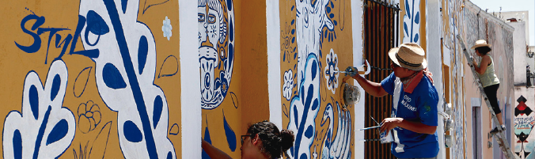

# Stylo FRAMEWORK
## A quick responsive-layout building Framework
This assignment consists of building a grid-based framework (similar to bootstrap) that includes some basic functionality necessary to build a website.

You can find the original project specification at: https://www.theodinproject.com/courses/html5-and-css3/lessons/design-your-own-grid-based-framework

### Overview
Stylofw allows us to create complex responsive layouts with just a few classes added to our HTML.
with 3 predefined breakpoints for mobile, tablet and desktop devices we can use only 1 class to define the container's behavior over 3 different viewports.

## [Check the Stylofw Showcase!](https://usagib.github.io/projects/stylo)

## [Check the CNN page cloned with Stylo!](https://usagib.github.io/projects/stylo/demo.html)

### How to have Stylo:
Basic Stylofw structure:

> 

    

      

        100% width in all viewport sizes
     

   

> 
 

- .stylorow {Creates a row with auto height}
- .stylo-1 {Creates an entire width (100%) wrapper}
- .stylo-2 {Creates a half width (50%) wrapper}
- .stylo-3 {Creates a third width (33%) wrapper}
- .stylo-4 {Creates a quarter width (25%) wrapper}**

**stylo-1 to stylo-4 help us divide the row in as many wrappers as we like with auto height**

### stLG-MD-SM responsive classes

st classes had the following sintax:
- **.st[number of divisions in large viewports]-[number of divisions in medium viewports]--[number of divisions in small viewports]**

ej:
- **.st4-2-1**
1. the following class will be 25% (/4) width in 1024px screens
2. the following class will be 50% (/2) width in 740px screens
3. the following class will be 100% (/1) width in 420px screens
4. containers following the same class will auto-wrap in each breakpoint

### Stylo Working!
ej:
> 

        

          

            <h1 class="title">st3-2-1</h1>
            
          

          

            <h1 class="title">st3-2-1</h1>
            
          

          

            <h1 class="title">st3-2-1</h1>
            
          

          

            <h1 class="title">st3-2-1</h1>
            
          

          

            <h1 class="title">st3-2-1</h1>
            
          

          

            <h1 class="title">st3-2-1</h1>
            
          

        

>  

### large screens

### medium screens

### small screens

### Use st classes to make your own responsive layout!

## Additional classes
- .align {alingn text to center}
- .st-bgblack {adds black background to container}
- .fixed {fix container position}
- .title {Mansalva font with 1.5rem size}
- .st-bg {adds stylo background 1 to container}
- .st-bg1 {adds stylo background 2 to container}
- .st-bg2 {adds stylo background 3 to container}
- .mg-[sm md lg]-[left right top bottom]-[0 1 2 3] {adds margin with a direct size on selected viewport} **ej .mg-lg-left-3**
- .mg-[sm md lg]-[size 0-3] {adds all margins on selected viewport} **ej .mg-sm-3**
- .pd-[sm md lg]-[left right top bottom]-[0 1 2 3] {adds padding with a direct size on selected viewport} **ej .pd-lg-left-3**
- .pd-[sm md lg]-[size 0-3] {adds all paddings on selected viewport} **ej .pd-sm-3**
- .float[left right center] {applies float property} **ej. .floatright**
- .clear[left right both] {applies clear to float} **ej. clearleft**
- .flex {applies flex property to container}
- .hidden {hids display}
- .[lg md sm]-none { sets display property to none for selected viewprot} **ej md-none**
- .align-[h v]-[left right top bottom center] {sets vertical or horizontal aligment} **ej. align-v-bottom**
- .st-stbg-[1-10] {sets stylo custom color scheme background and font from 1-10}
- .aligntext-[left right center] {aligns text}
- .fontsize-[1-5] {sets the font size} **ej .fontsize-4**
- .fontbold {sets font weight to bold}
- .fontnormal {sets font weight to normal}
- .fontlight {sets font weight to light}
- .border[top bottom left right] {sets border to specific position }
- .border {sets all borders to normal solid}
- .border[top bottom left right]-[light bold] {sets border to specific position lighter or bolder }
- .border-[light bold] {sets all borders to light or bold solid}
- .borderround {sets round border corner}
- .bordercircle {defines border as a circle}
- .stylo-gutter {adds gutters to all divisiors on container}
- .he1 to .he5 {defines fixed height 50px to 500px}
- .nowrap {avoids row wrapping}

## [Check the Stylofw Showcase!](https://usagib.github.io/stylo)

## [Check the CNN page cloned with Stylo!](https://usagib.github.io/stylo/demo.html)
